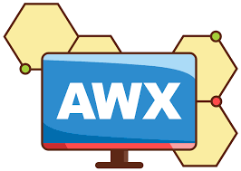

# AWX: History, Architecture, and Ecosystem

## Understanding the History of Ansible and AWX

## Ansible Core vs. AWX

## Community Ansible & AWX vs. Red Hat Ansible Automation Platform

### Security and Compliance

### Certified Content and Ecosystem

### Lifecycle Support

### Legal Protections

### Analytics and Insights

### Upgrades and Migrations

### Training and Consulting

### Cloud Deployment Options

### Event-Driven Automation

### Private Automation Hub

### Generative AI Integration

## Which One Should You Choose?

## AWX Architecture

### Execution Environments

### Web Interface and API

### Task Dispatching and Event Handling