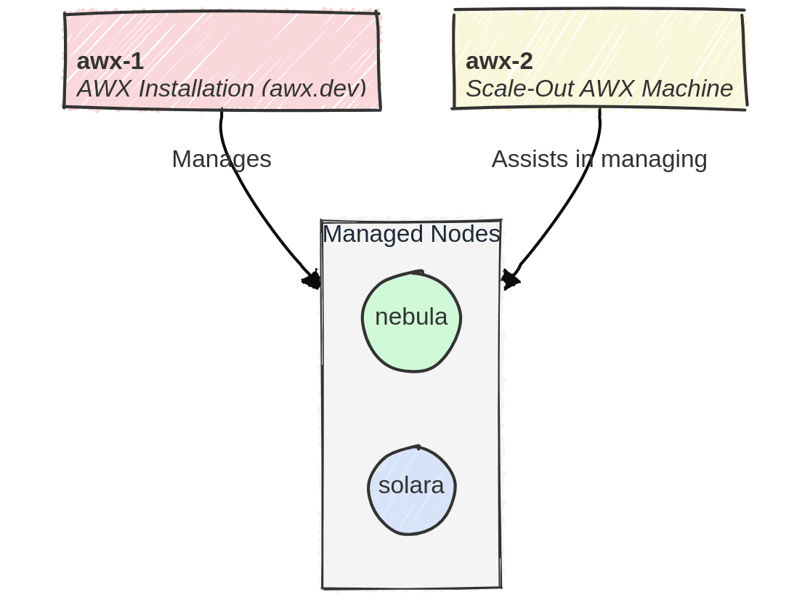
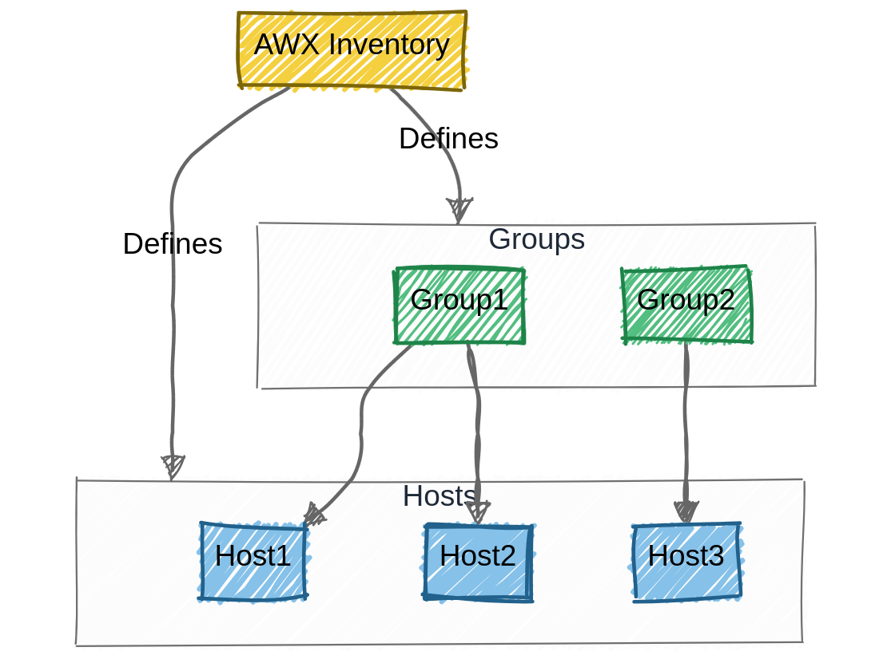
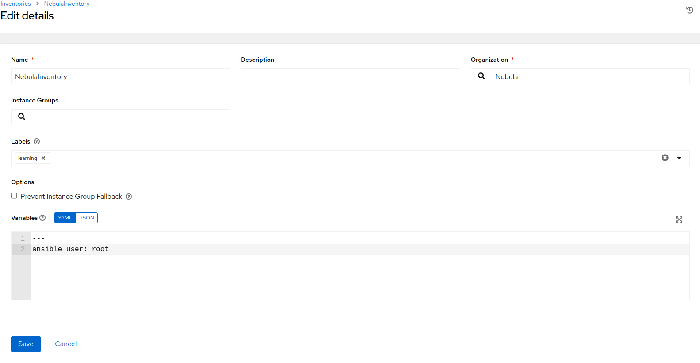
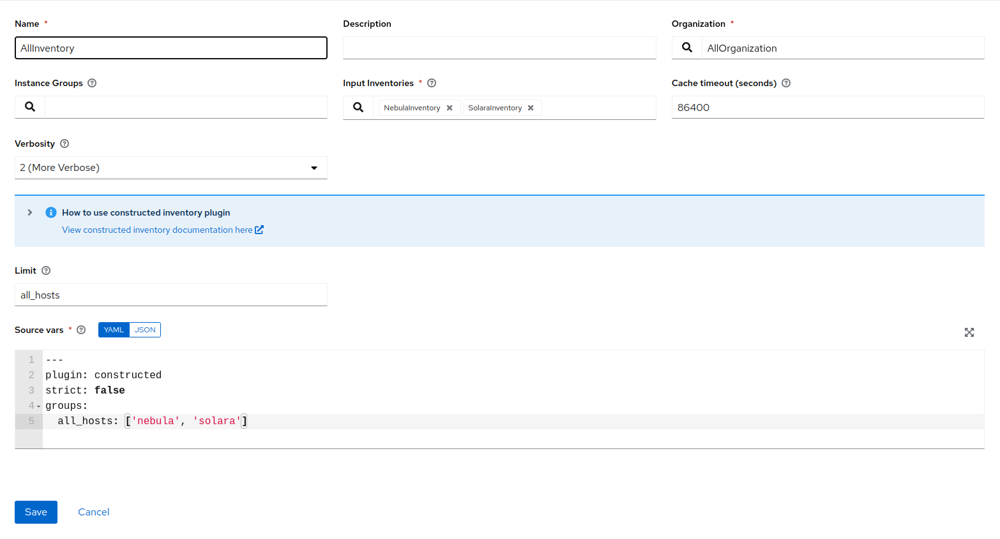
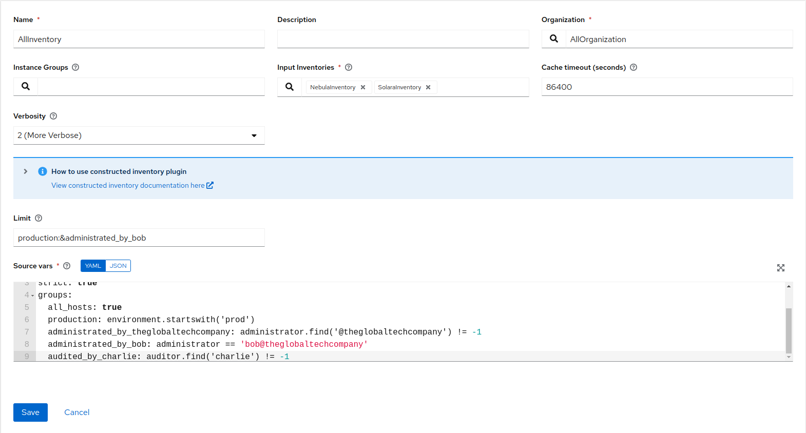
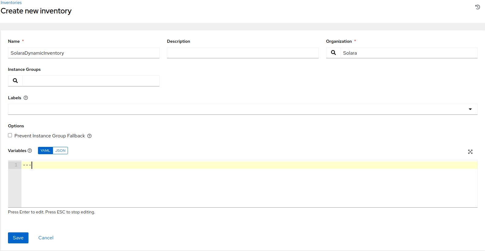
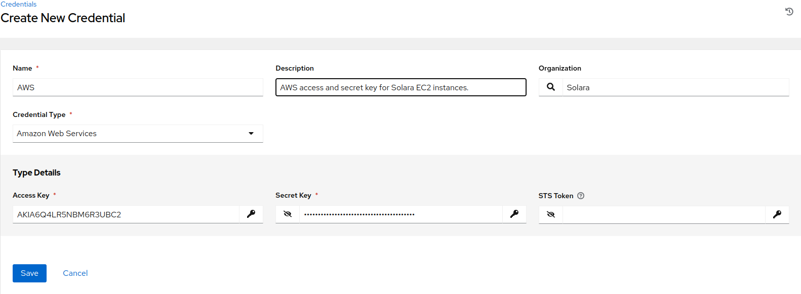
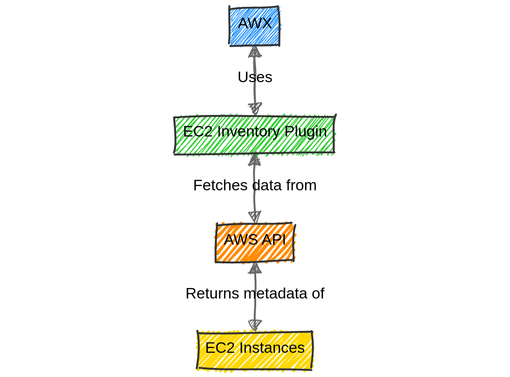
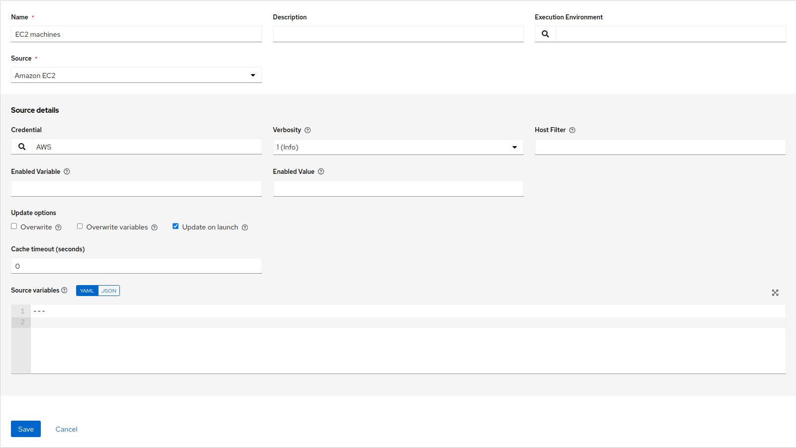
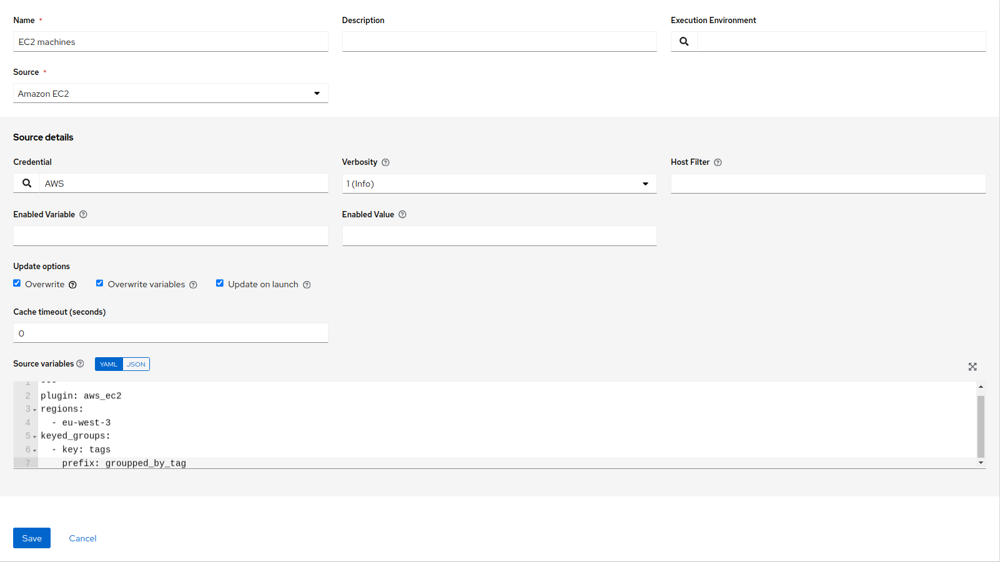

# Hosts and Inventories


## Introduction




```bash
# Run the following commands on your local machine

# Export the IP addresses of the machines
# Change the IP addresses to the actual IP addresses of your machines
export AWX1_PUBLIC_IP=<AWX1_PUBLIC_IP>
export AWX2_PUBLIC_IP=<AWX2_PUBLIC_IP>
export NEBULA_PUBLIC_IP=<NEBULA_PUBLIC_IP>
export SOLARA_PUBLIC_IP=<SOLARA_PUBLIC_IP>

# Backup your .bashrc file
cp ~/.bashrc ~/.bashrc.bak

# Add the IP addresses to your .bashrc file to avoid exporting them every time
cat << EOF >> ~/.bashrc
export AWX1_PUBLIC_IP=$AWX1_PUBLIC_IP
export AWX2_PUBLIC_IP=$AWX2_PUBLIC_IP
export NEBULA_PUBLIC_IP=$NEBULA_PUBLIC_IP
export SOLARA_PUBLIC_IP=$SOLARA_PUBLIC_IP
EOF

# Source the .bashrc file to apply the changes
source ~/.bashrc
```


```bash
# Create the SSH key pair
ssh root@$AWX1_PUBLIC_IP 'ssh-keygen -t rsa -b 4096 -f ~/.ssh/id_rsa -N ""'

# Copy the public key from the AWX machine to the your local machine
scp root@$AWX1_PUBLIC_IP:~/.ssh/id_rsa.pub /tmp/awx_id_rsa.pub

# Append the public key to the authorized_keys file on the awx-2 machine
ssh \
  -o StrictHostKeychecking=no \
  root@$AWX2_PUBLIC_IP \
  "echo $(cat /tmp/awx_id_rsa.pub) >> ~/.ssh/authorized_keys"

# Append the public key to the authorized_keys file on the nebula machine
ssh \
  -o StrictHostKeychecking=no \
  root@$NEBULA_PUBLIC_IP \
  "echo $(cat /tmp/awx_id_rsa.pub) >> ~/.ssh/authorized_keys"

# Append the public key to the authorized_keys file on the solara machine
ssh \
  -o StrictHostKeychecking=no \
  root@$SOLARA_PUBLIC_IP \
  "echo $(cat /tmp/awx_id_rsa.pub) >> ~/.ssh/authorized_keys"
```


```bash
# Backup the hosts file
sudo cp /etc/hosts /etc/hosts.bak

# Add the entry
cat << EOF | sudo tee -a /etc/hosts
$AWX1_PUBLIC_IP awx.example.com
EOF

# Make sure the entry is added
cat /etc/hosts | \
  grep awx.example.com | \
  grep $AWX1_PUBLIC_IP | \
  wc -l | \
  xargs -I {} test {} -eq 1 && \
  echo "Entries added successfully" || \
  echo "Entries not added"
```


## Creating an Inventory of Hosts in AWX


```plaintext
Inventory
├── Hosts
│   ├── Host1
│   ├── Host2
└── Groups
    ├── Web
    │   ├── Host1
    │   └── Host2
    └── DB
        └── Host3
```






```yaml
---
ansible_host: <NEBULA_PRIVATE_IP>
environment: production
administrator: alice@theglobaltechcompany
auditor: charlie@theglobaltechcompany
```


```yaml
---
ansible_host: <SOLARA_PRIVATE_IP>
environment: production
administrator: bob@theglobaltechcompany
auditor: charlie@theglobaltechcompany
```


## Adding Credentials


## Constructed Inventories


```yaml
---
plugin: constructed
strict: false
groups:
  all_hosts: ['nebula', 'solara']
```




```yaml
---
ansible_host: <NEBULA_PRIVATE_IP>
environment: production
administrator: alice@theglobaltechcompany
auditor: charlie@theglobaltechcompany
```


```yaml
---
ansible_host: <SOLARA_PRIVATE_IP>
environment: production
administrator: bob@theglobaltechcompany
auditor: charlie@theglobaltechcompany
```


```yaml
---
plugin: constructed
strict: true
groups:
  all_hosts: true
  production: environment.startswith('prod')
  administrated_by_theglobaltechcompany: administrator.find('@theglobaltechcompany') != -1
  administrated_by_bob: administrator == 'bob@theglobaltechcompany'
  audited_by_charlie: auditor.find('charlie') != -1
```




```yaml
---
plugin: constructed
strict: true
groups:
  all_hosts: true
  production: environment | default('') | regex_search('^prod')
  administrated_by_theglobaltechcompany: administrator | default('') | regex_search('@theglobaltechcompany')
  administrated_by_bob: administrator | default('') == 'bob@theglobaltechcompany'
  audited_by_charlie: auditor | default('') | regex_search('charlie')
```


```yaml
---
plugin: constructed
strict: true
compose:
  bios_year: ansible_bios_date.split('/')[2]
groups:
  bios_year_before_2000: bios_year | int < 2000
  bios_year_after_2000: bios_year | int >= 2000
```


## Dynamic Inventories




```bash
# Create the IAM user
aws iam create-user --user-name awx-ec2-user
# Attach the AmazonEC2ReadOnlyAccess policy to the user
aws iam attach-user-policy --user-name awx-ec2-user --policy-arn arn:aws:iam::aws:policy/AmazonEC2ReadOnlyAccess
# Create an access key for the user
aws iam create-access-key --user-name awx-ec2-user > /tmp/awx-ec2-user.json
```


```bash
# Print the Access Key ID
echo $(jq -r '.AccessKey.AccessKeyId' /tmp/awx-ec2-user.json)
# Print the Secret Access Key
echo $(jq -r '.AccessKey.SecretAccessKey' /tmp/awx-ec2-user.json)
```




```bash
aws ec2 create-key-pair \
--key-name MyKeyPair \
--query 'KeyMaterial' \
--output text > MyKeyPair.pem
```


```bash
chmod 400 MyKeyPair.pem
```


```bash
export CONTROL_NODE_IP=[THE_CONTROL_NODE_IP]
scp MyKeyPair.pem root@$CONTROL_NODE_IP:~/.ssh/
```


```bash
aws ec2 create-security-group \
--group-name MySecurityGroup \
--description "Security group for SSH access"
```


```bash
aws ec2 authorize-security-group-ingress \
--group-name MySecurityGroup \
--protocol tcp \
--port 22 \
--cidr 0.0.0.0/0
```


```bash
export AMI_ID=[THE_AMI_ID]
export AWS_REGION=[THE_AWS_REGION]
```


```bash
export AMI_ID=ami-09a477b0776212c5c	
export AWS_REGION=eu-west-3
```


```bash
aws ec2 run-instances \
    --image-id $AMI_ID \
    --count 1 \
    --instance-type t2.micro \
    --key-name MyKeyPair \
    --security-groups MySecurityGroup \
    --region $AWS_REGION \
    --tag-specifications \
    'ResourceType=instance,Tags=[{Key=Name,Value=mysql-machine},{Key=Role,Value=mysql}]'
```


```bash
aws ec2 run-instances \
    --image-id $AMI_ID \
    --count 1 \
    --instance-type t2.micro \
    --key-name MyKeyPair \
    --security-groups MySecurityGroup \
    --region $AWS_REGION \
    --tag-specifications \
    'ResourceType=instance,Tags=[{Key=Name,Value=web-machine},{Key=Role,Value=web}]'
```


```bash
aws ec2 describe-instances --region $AWS_REGION | \
jq '.Reservations[].Instances[] | {
      Name: (if (.Tags[]? | select(.Key == "Name")) then 
                (.Tags[] | select(.Key == "Name") | .Value) 
             else 
                "N/A" 
             end),
      State: .State.Name, 
      IP: (if .PublicIpAddress then 
              .PublicIpAddress 
           else 
              "N/A" 
           end)
    }'
```


```json
{
  "Name": "mysql-machine",
  "State": "running",
  "IP": "x.x.x.x"
}
{
  "Name": "web-machine",
  "State": "running",
  "IP": "x.x.x.x"
}
```






```json
{
  "ami_launch_index": 0,
  "architecture": "x86_64",
  [...]
  [...]
  "owner_id": "998335703874",
  "placement": {
    "availability_zone": "eu-west-3c",
    "group_name": "",
    "region": "eu-west-3",
    "tenancy": "default"
  },  
  [...]
  [...]
  "tags": {
    "Name": "mysql-machine",
    "Role": "mysql"
  },  
  [...]
  [...]
  "vpc_id": "vpc-04322ac8f19695f05"
}
```


```yaml
---
plugin: aws_ec2
regions:
  - eu-west-3
keyed_groups:
  - key: tags
    prefix: groupped_by_tag
```




```yaml
---
plugin: aws_ec2
regions:
  - eu-west-3
keyed_groups:
keyed_groups:
  - key: instance_type
    prefix: instance_type
  - key: placement.availability_zone
    prefix: availability_zone
  - key: placement.region
    prefix: region
```


```bash
export ACCESS_KEY_ID=[THE_ACCESS_KEY_ID]
```


```bash
# Get instance IDs for instances with "Name: mysql-machine" tag
mysql_instance_ids=$(aws ec2 describe-instances \
  --query "Reservations[*].Instances[?Tags[?Key=='Name'&&Value=='mysql-machine']].InstanceId" \
  --output text)

# Get instance IDs for instances with "Name: web-machine" tag
web_instance_ids=$(aws ec2 describe-instances \
  --query "Reservations[*].Instances[?Tags[?Key=='Name'&&Value=='web-machine']].InstanceId" \
  --output text)

# Terminate the instances
aws ec2 terminate-instances \
  --instance-ids $mysql_instance_ids $web_instance_ids

# Delete the key pair
aws ec2 delete-key-pair \
  --key-name MyKeyPair

# Delete the security group (you should wait for the instances to be terminated first)
aws ec2 delete-security-group \
  --group-name MySecurityGroup

# Delete the IAM user. Replace the $ACCESS_KEY_ID with the actual value
aws iam delete-access-key \
  --access-key-id $ACCESS_KEY_ID \
  --user-name awx-ec2-user

# Detach policy from the IAM user
aws iam detach-user-policy \
  --user-name awx-ec2-user \
  --policy-arn arn:aws:iam::aws:policy/AmazonEC2ReadOnlyAccess

# Delete the IAM user
aws iam delete-user \
  --user-name awx-ec2-user
```