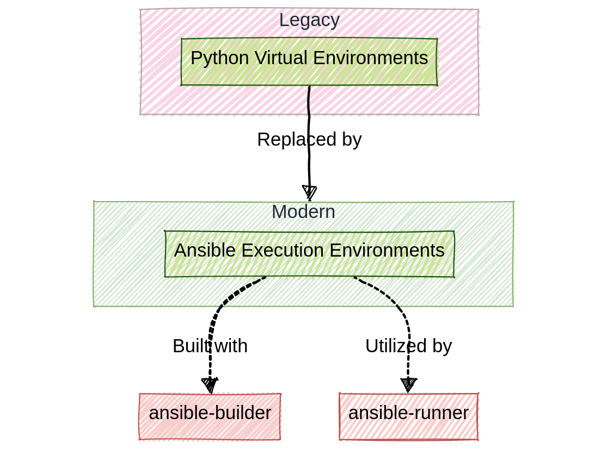
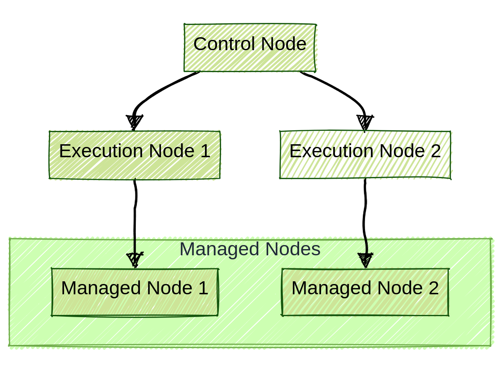
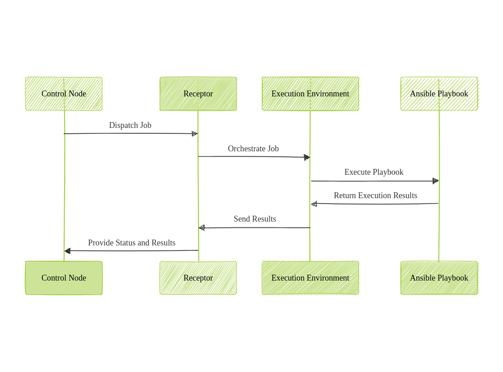
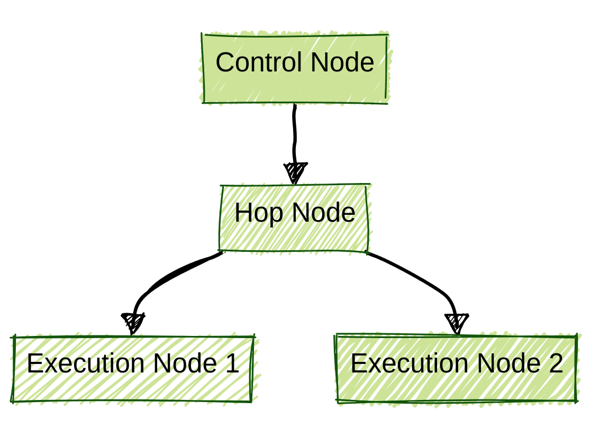
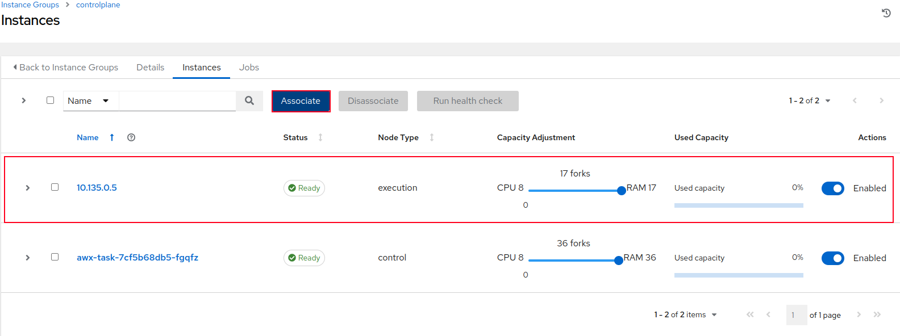
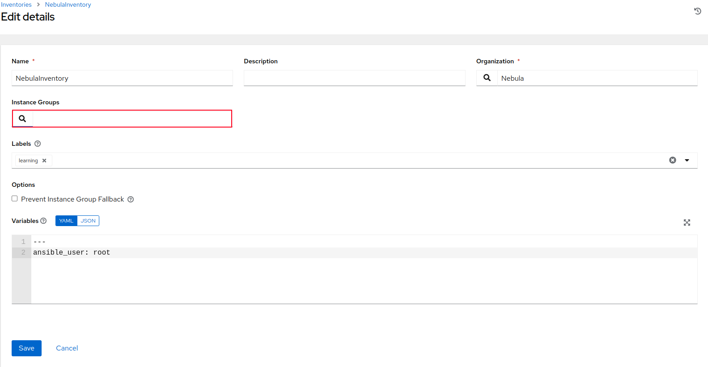
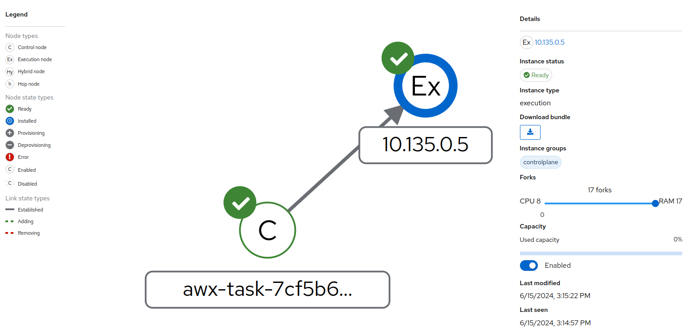

# Execution Environments, Execution Instances and Hop Instances


## Execution Environments




## Ansible Builder


```Dockerfile
# syntax=docker/dockerfile:1

FROM ubuntu:24.04
WORKDIR /app
COPY . .
RUN apt-get update && apt-get install -y nodejs npm
CMD ["node", "src/index.js"]
EXPOSE 3000
```


## Ansible Runner


## Adding Execution Environments


## Building Execution Environments


```bash
# Create a folder for the environment
cd $HOME
mkdir -p execution-environments/custom
cd execution-environments/custom
# Update the package list
yum check-update
# Install Python 3 and pip
yum install -y python3 python3-pip
# Create a virtual environment
python3 -m venv venv
# Activate the virtual environment
source venv/bin/activate
# Install ansible-builder
pip install ansible-builder==3.0.1
```


```bash
# Install Docker if you didn't already
curl -fsSL https://get.docker.com | sh
# Start and enable Docker
systemctl start docker
systemctl enable docker
```


```yaml
cat <<EOF > execution-environment.yml
---
version: 3

images:
  base_image:
    name: quay.io/centos/centos:stream9

dependencies:
  ansible_core:
    package_pip: ansible-core==2.15.0
  ansible_runner:
    package_pip: ansible-runner      
  galaxy: requirements.yml
  python: requirements.txt
  system: bindep.txt
EOF
```


```yaml
cat <<EOF > requirements.yml
---
collections:
  - name: community.general
    version: 9.0.1
  - name: ansible.posix
    version: 1.5.4
EOF
```


```bash
cat <<EOF > requirements.txt
psutil==5.9.8
EOF
```


```txt
cat <<EOF > bindep.txt
openssh-clients
EOF
```


```bash
# Export your Docker Hub username
export DOCKERHUB_USERNAME=<your-dockerhub-username>
# Build the execution environment
ansible-builder build \
  --file=execution-environment.yml \
  --tag=$DOCKERHUB_USERNAME/my-custom-ee:1.0 \
  --container-runtime=docker \
  --verbosity=3
```


```bash
docker images | grep my-custom-ee
```


```bash
# View the resulting Dockerfile
cat ./context/Dockerfile
```


```bash
docker login -u $DOCKERHUB_USERNAME
docker push $DOCKERHUB_USERNAME/my-custom-ee:1.0
```


```yaml
additional_build_steps:
  prepend_base:
    - RUN echo "Commands to run before the base image is built"
  
  append_base:
    - RUN echo "Commands to run after the base image is built"

  prepend_galaxy:
    - RUN echo "Commands to run before building the Galaxy image"

  append_galaxy:
    - RUN echo "Commands to run after building the Galaxy image"

  prepend_builder:
    - RUN echo "Commands to run before building the builder image"

  append_builder:
    - RUN echo "Commands to run after building the builder image"
    
  prepend_final:
    - RUN echo "Commands to run before building the final image"

  append_final:
    - RUN echo "Commands to run after building the final image"
```


## Execution and Hop Instances


### Execution Instances






```bash
# Export the downloaded file path
export BUNDLE_PATH=<path-to-bundle>
# Rename the bundle to keep a consistent name after the upload
mv $BUNDLE_PATH /tmp/bundle.tar.gz
# Upload the bundle to the AWX instance
scp /tmp/bundle.tar.gz root@awx.example.com:/tmp
# Back to the AWX instance
ssh root@awx.example.com
# Extract the bundle
mkdir -p /tmp/bundle
cd /tmp
tar -xvf bundle.tar.gz -C /tmp/bundle --strip-components 1
```


```bash
# Update the package list
sudo dnf check-update
# Install Ansible
dnf install epel-release-9-7.el9 -y
dnf install ansible-7.7.0-1.el9 -y
```


```yaml
---
all:
  hosts:
    remote-execution:
      ansible_host: <ip-address>
      ansible_user: <username> # user provided
      ansible_ssh_private_key_file: ~/.ssh/id_rsa
```


```bash
export AWX2_PRIVATE_IP=<AWX2_PRIVATE_IP>
```


```yaml
cat << EOF > /tmp/bundle/inventory.yml
---
all:
  hosts:
    remote-execution:
      ansible_host: $AWX2_PRIVATE_IP
      ansible_user: root
      ansible_ssh_private_key_file: ~/.ssh/id_rsa
      ansible_ssh_common_args: '-o StrictHostKeyChecking=no'
EOF
```


```bash
cd /tmp/bundle
ansible -i inventory.yml all -m ping
```


```bash
cd /tmp/bundle
# Install the requirements using ansible-galaxy
# This will install podman and run other OS-specific tasks
ansible-galaxy collection install -r requirements.yml --force
# Run the playbook
ansible-playbook -i inventory.yml install_receptor.yml
```


### Hop Instances




### Hybrid Nodes


### Control Nodes


## Instance Groups and Clustering






## Instance Capacity Adjustment


```
forks = (total_memory - memory_reserved) / memory_per_fork
```


```
forks = (8GB - 2GB) / 100MB = 60
```


```
forks = (total_cores * 4)
```


```
forks = 4 * 4 = 16
```


## Container Groups


```yaml
kubectl apply -f - <<EOF
---
apiVersion: v1
kind: ServiceAccount
metadata:
  name: containergroup-service-account
  namespace: containergroup-namespace
---
kind: Role
apiVersion: rbac.authorization.k8s.io/v1
metadata:
  name: role-containergroup-service-account
  namespace: containergroup-namespace
rules:
  - apiGroups: [""]
    resources: ["pods"]
    verbs: ["get", "list", "watch", "create", "update", "patch", "delete"]
  - apiGroups: [""]
    resources: ["pods/log"]
    verbs: ["get", "list", "watch", "create", "update", "patch", "delete"]
  - apiGroups: [""]
    resources: ["pods/attach"]
    verbs: ["get", "list", "watch", "create", "update", "patch", "delete"]
---
kind: RoleBinding
apiVersion: rbac.authorization.k8s.io/v1
metadata:
  name: role-containergroup-service-account-binding
  namespace: containergroup-namespace
subjects:
  - kind: ServiceAccount
    name: containergroup-service-account
    namespace: containergroup-namespace
roleRef:
  kind: Role
  name: role-containergroup-service-account
  apiGroup: rbac.authorization.k8s.io
EOF
```


```bash
export SA_SECRET=$(oc get sa containergroup-service-account -o json | jq '.secrets[0].name' | tr -d '"')
oc get secret $(echo ${SA_SECRET}) -o json | jq '.data.token' | xargs | base64 --decode > containergroup-sa.token
```


```bash
oc get secret $SA_SECRET -o json | jq '.data["ca.crt"]' | xargs | base64 --decode > containergroup-ca.crt
```


```yaml
apiVersion: v1
kind: Pod
metadata:
  # Define the namespace where you want to run the pod
  namespace: my-namespace
  # Define labels for the pod, useful for identifying and organizing pods
  labels:
    app: my-automatic-job
spec:
  # Specify the service account name that the pod will use
  serviceAccountName: default
  # Prevent the service account token from being automatically mounted
  automountServiceAccountToken: false
  containers:
    # Define the container that will run the job

    # The execution environment image
    - image: quay.io/ansible/awx-ee:latest  
      # Name of the container (should be worker)
      name: worker  
      args:
        # Command to run inside the container
        - ansible-runner  
        - worker
        - '--private-data-dir=/runner'
      resources:
        # Specify the resource requests for the container
        requests:
          # Request the CPU capacity
          cpu: 250m  
          # Request the memory capacity
          memory: 100Mi  
        # Optionally, you can define limits here as well
        # limits:
        #   cpu: 500m  # Limit to 500 millicores of CPU
        #   memory: 200Mi  # Limit to 200 MiB of memory
  # Define the restart policy for the pod
  restartPolicy: Never
  # ...etc
```


## Topology View

