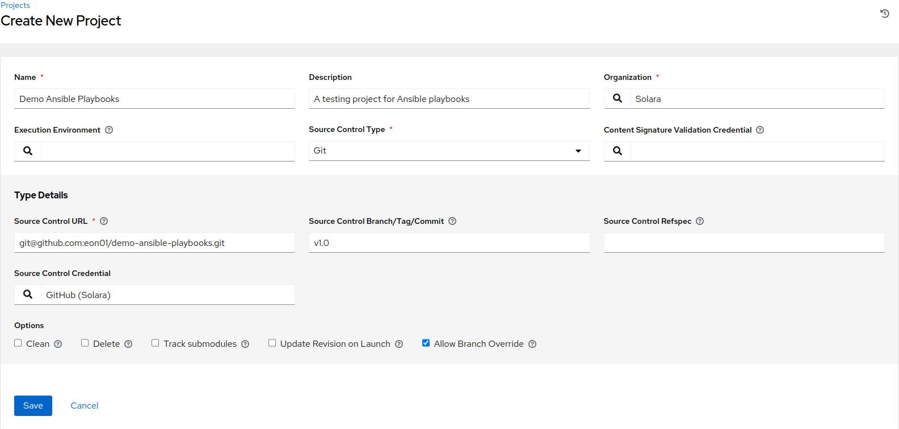
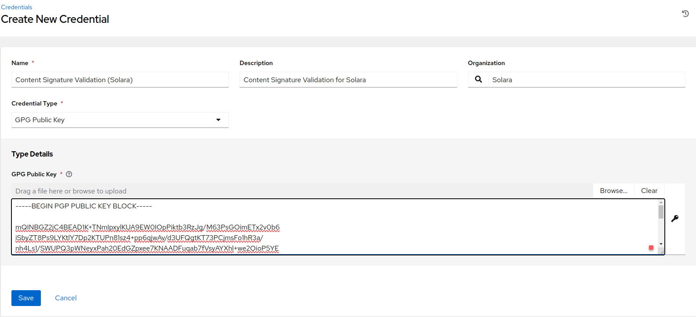
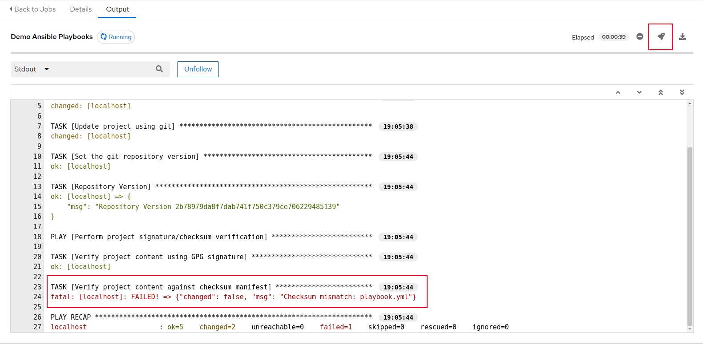
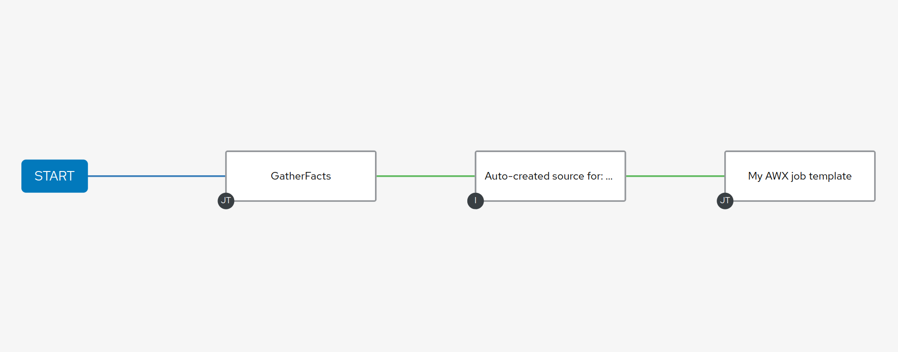
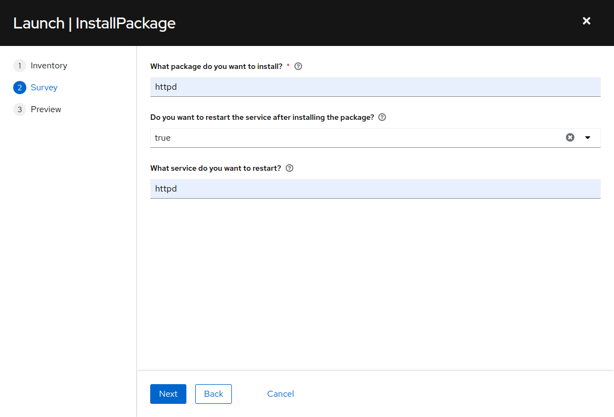
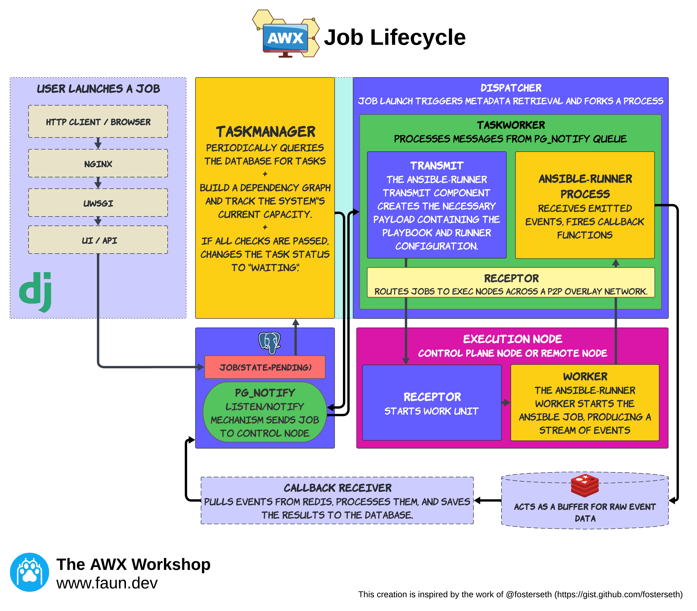

# Projects, Templates, and Jobs


## Running Adhoc Commands


```yaml
name=epel-release,tree state=present update_cache=yes
```


```bash
nebula | CHANGED => {
    "ansible_facts": {
        "discovered_interpreter_python": "/usr/bin/python3"
    },
    "changed": true,
    "msg": "",
    "rc": 0,
    "results": [
        "Installed: epel-release-9-7.el9.noarch",
        "Installed: epel-next-release-9-7.el9.noarch"
    ]
}
```


## AWX Projects


### Creating a Manual Project


```bash
kubectl -n awx get pv
```


```bash
kubectl -n awx describe pv awx-projects-volume
```


```bash
Name:            awx-projects-volume
Labels:          <none>
Annotations:     pv.kubernetes.io/bound-by-controller: yes
Finalizers:      [kubernetes.io/pv-protection]
StorageClass:    awx-projects-volume
Status:          Bound
Claim:           awx/awx-projects-claim
Reclaim Policy:  Retain
Access Modes:    RWO
VolumeMode:      Filesystem
Capacity:        2Gi
Node Affinity:   <none>
Message:         
Source:
    Type:          HostPath (bare host directory volume)
    Path:          /data/projects
    HostPathType:  
Events:            <none>
```


```yaml
mkdir -p /data/projects/uptime
```


```yaml
cat <<EOF > /data/projects/uptime/up.yml
---
- name: Check uptime
  hosts: all
  tasks:
    - name: Get uptime
      command: uptime
    register: uptime

    - name: Print uptime
      debug:
        msg: "This node has been up for {{ uptime.stdout }}"
EOF
```


```bash
chown -R awx:awx /data/projects/uptime
```


```bash
# Check that the uptime project has been added
kubectl -n awx exec -it deployment/awx-web -c awx-web -- ls -l /var/lib/awx/projects
# Check that the uptime playbook has been added to the project
kubectl -n awx exec -it deployment/awx-web -c awx-web -- ls -l /var/lib/awx/projects/uptime
```


### Creating a Git Project


```bash
dnf install -y git
```


```bash
dnf install 'dnf-command(config-manager)'
dnf config-manager --add-repo https://cli.github.com/packages/rpm/gh-cli.repo
dnf install gh --repo gh-cli -y
```


```bash
export GH_TOKEN=<YOUR_GITHUB_TOKEN>
export GH_USER=<YOUR_GITHUB_USERNAME>
export GH_EMAIL=<YOUR_GITHUB_EMAIL>
```


```bash
gh repo create demo-ansible-playbooks --private
```


```bash
mkdir -p /data/projects/demo-ansible-playbooks
cd /data/projects/demo-ansible-playbooks
git init
```


```yaml
cat <<EOF > /data/projects/demo-ansible-playbooks/playbook.yml
---
- name: Install epel-release
  hosts: all
  tasks:
    - name: Install epel-release
      yum:
        name: epel-release
        state: present
EOF
```


```bash
git add .
```


```bash
# Add an author identity
git config --global user.email "$GH_EMAIL"
git config --global user.name "$GH_USER"
# Change the branch name to main
git branch -M main
# Add the remote repository
git remote add origin git@github.com:$GH_USER/demo-ansible-playbooks.git
```


```bash
git commit -m "Initial commit"
```


```bash
gh ssh-key add ~/.ssh/id_rsa.pub --title "AWX"
```


```bash
cat <<EOF > /data/projects/demo-ansible-playbooks/.gitignore
# Ignore Linux system files
*.swp
*~
# Ignore Ansible artifacts
*.retry
# Ignore Python virtual environment
venv/
EOF
```


```bash
git push -u origin main
```


```bash
git tag -a v1.0 -m "Initial commit"
git push origin v1.0
```





### Enabling Content Signature Validation


```bash
gpg --list-secret-keys
```


```bash
export REAL_NAME="<YOUR_REAL_NAME>"
export EMAIL="<YOUR_EMAIL>"
```


```bash
gpg --full-gen-key --batch <( \
    echo "Key-Type: 1"; \
    echo "Key-Length: 4096"; \
    echo "Subkey-Type: 1"; \
    echo "Subkey-Length: 4096"; \
    echo "Expire-Date: 0"; \
    echo "Name-Real: $REAL_NAME"; \
    echo "Name-Email: $EMAIL"; \
    echo "%no-protection"; )
```


```bash
gpg --armor --export $EMAIL
```




```bash
# Install virtualenv
pip3 install virtualenv
# Create a virtual environment
cd /data/projects/demo-ansible-playbooks
virtualenv venv
# Activate the virtual environment
source venv/bin/activate
# Install ansible-sign
pip install ansible-sign==0.1.1
```


```bash
cat <<EOF > /data/projects/demo-ansible-playbooks/MANIFEST.in
include playbook.yml
exclude .gitignore
recursive-exclude .git *
recursive-exclude .github *
recursive-exclude venv *
EOF
```


```bash
# Include all yaml files in the current directory
include *.yml *.yaml
# Exclude all files that end with .retry in the current directory
exclude *.retry
# Recursively include all files in the roles directory
recursive-include roles *
# Add all files in the files directory matching the pattern *.txt
global-include *.txt
```


```bash
ansible-sign project gpg-sign .
```


```bash
gpg --fingerprint $EMAIL
# or
# gpg --list-keys
```


```bash
ansible-sign project gpg-sign --fingerprint <YOUR_FINGERPRINT> .
```


```bash
git add playbook.yml
git add MANIFEST.in .ansible-sign/*
git commit -m "Signed content"
git push origin main
```


```bash
git tag -a v1.1 -m "Signed content"
git push origin v1.1
```


```bash
cat <<EOF > /data/projects/demo-ansible-playbooks/playbook.yml
---
- name: Install epel-release
  hosts: all
  tasks:
    - name: Install epel-release
      yum:
        name: epel-release
        state: present
    - name: Install tree
      yum:
        name: tree
        state: present
EOF
```


```bash
git add playbook.yml
git commit -m "Add tree package"
git push origin main
git tag -f v1.1
git push -f origin v1.1
```




## Job Templates


### Creating a Job Template


```yaml
---
- name: Install and restart httpd
  hosts: all
  tasks:
    - name: Install httpd
      yum:
        name: httpd
        state: present
      tags:
        - package
    - name: Restart httpd
      service:
        name: httpd
        state: restarted
      tags:
        - service
```


```bash
ansible-playbook playbook.yml --tags package
```


```bash
ansible-playbook playbook.yml --skip-tags service
```


## Launching a Job


## Scheduling a Job


```yaml
# Create the project directory
mkdir -p /data/projects/GatherFacts

# Create the playbook
cat << 'EOF' > /data/projects/GatherFacts/gather_facts.yml
---
- hosts: all
  gather_facts: true
  tasks:
    - name: Gather facts
      debug:
        var: ansible_facts
EOF
```


## Workflow Templates




### Adding Approval Nodes


## Surveys


```yaml
# Create the project directory
mkdir -p /data/projects/InstallPackage

# Create the playbook
cat << 'EOF' > /data/projects/InstallPackage/install_package.yml
---
- name: Install package and optionally restart service
  hosts: all
  # Ensures that tasks are run with elevated privileges
  become: yes

  tasks:
    - name: Install a package using YUM
      ansible.builtin.yum:
        name: "{{ package }}"
        state: present
      # This task runs if the target system is from the RedHat family (CentOS, Fedora, etc.)
      when: ansible_os_family == "RedHat"
      

    - name: Install a package using APT
      ansible.builtin.apt:
        name: "{{ package }}"
        state: present
      # This task runs if the target system is from the Debian family (Ubuntu, Debian, etc.)
      when: ansible_os_family == "Debian"
      

    - name: Restart a service
      ansible.builtin.systemd:
        name: "{{ service }}"
        state: restarted
      when: restart_service is defined and restart_service|bool
      # This task will only execute if `restart_service` is defined and true. 
      # It uses the `systemd` module to restart the specified service.
EOF
```





## Key Objects and Their Relationships in Task Automation


## AWX Job Lifecycle

