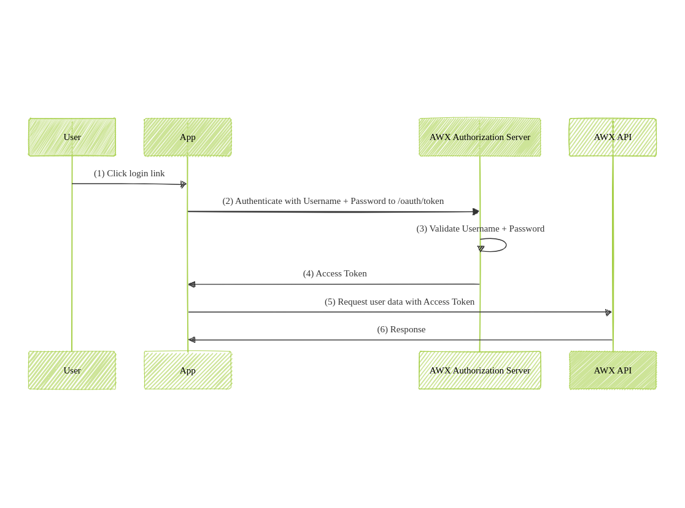

# AWX CLI


## What is the AWX CLI?


## Why Use the AWX CLI?


## Installing the AWX CLI


```bash
yum-config-manager --add-repo \
    https://releases.ansible.com/ansible-tower/cli/ansible-tower-cli-el7.repo
yum install ansible-tower-cli
```


```bash
yum-config-manager --add-repo \
    https://releases.ansible.com/ansible-tower/cli/ansible-tower-cli-centos7.repo
yum install ansible-tower-cli
```


```bash
dnf config-manager --add-repo \
    https://releases.ansible.com/ansible-tower/cli/ansible-tower-cli-el8.repo
dnf install ansible-tower-cli
```


```bash
dnf config-manager --add-repo \
    https://releases.ansible.com/ansible-tower/cli/ansible-tower-cli-centos8.repo
dnf install ansible-tower-cli
```


```bash
dnf install python3-pip -y
pip3 install awxkit==24.6.0
```


## Authenticating AWX CLI


### Using the CLI


```bash
# Export these environment variables
export TOWER_HOST=<TOWER_HOST>
export TOWER_USERNAME=<USERNAME>
export TOWER_PASSWORD=<PASSWORD>
```


```bash
export TOWER_HOST=https://awx.example.com
export TOWER_USERNAME=admin
export TOWER_PASSWORD=Ansible123!
```


```bash
# Generate a token
awx login -k \
    --conf.host $TOWER_HOST \
    --conf.username $TOWER_USERNAME \
    --conf.password $TOWER_PASSWORD
```


```bash
{
     "token": "8hds7eFzHRvWC1U8RPze8pLeyMAmED"
}
```


```bash
export TOWER_OAUTH_TOKEN=<TOWER_OAUTH_TOKEN>
```


```bash
awx -k user list -f human
awx -k organization list -f human
awx -k job list -f human
```


### Using the API


```bash
export TOWER_HOST=<TOWER_HOST>
export TOWER_USERNAME=<USERNAME>
export TOWER_PASSWORD=<PASSWORD>
```


```bash
curl -k -X POST -u $TOWER_USERNAME:$TOWER_PASSWORD \
    "$TOWER_HOST/api/v2/tokens/"
```


```json
{
  "id": 10,
  "type": "o_auth2_access_token",
  "url": "/api/v2/tokens/10/",
  "related": {
    "user": "/api/v2/users/1/",
    "activity_stream": "/api/v2/tokens/10/activity_stream/"
  },
  "summary_fields": {
    "user": {
      "id": 1,
      "username": "admin",
      "first_name": "",
      "last_name": ""
    }
  },
  "created": "2024-06-30T08:05:58.131971Z",
  "modified": "2024-06-30T08:05:58.141729Z",
  "description": "",
  "user": 1,
  "token": "1FhgaK4Fzt9LOL8rQW4uWsj3PPpF86",
  "refresh_token": null,
  "application": null,
  "expires": "3023-11-01T08:05:58.124983Z",
  "scope": "write"
}
```


```bash
export TOWER_OAUTH_TOKEN=<TOWER_OAUTH_TOKEN>
```


```bash
awx -k user list -f human
awx -k organization list -f human
awx -k job list -f human
```


### Using the AWX Web Interface


```bash
export TOWER_OAUTH_TOKEN=<TOWER_OAUTH_TOKEN>
```


## AWX Applications and Tokens


### Authorization Grant Type


#### Authorization Code


#### Resource Owner Password-Based Grant Type




### Redirect URIs


### Client Type


#### Confidential


#### Public


## Generating Organization-Scoped Tokens


```bash
export TOWER_HOST=<TOWER_HOST>
export TOWER_CLIENT_ID=<CLIENT_ID>
export TOWER_CLIENT_SECRET=<CLIENT_SECRET>
export TOWER_USERNAME=<USERNAME>
export TOWER_PASSWORD=<PASSWORD>
```


```bash
export TOWER_HOST=https://awx.example.com
export TOWER_CLIENT_ID=TFmacehUsE3CjNRq7S5Ppj3tEhvdyX52DgnAGq19
export TOWER_CLIENT_SECRET=IDfJgy8Io8f7XXBX75uW8Q0EosLy9AtzUpZr9HELxlulyinxBFkYEWB33FJHnLjpAecs3PsP49mPMAehofcf5uHGMdO1aLGpXTtKYWYlLlDuNqVIuXpGoTNiWk8zvjEN
export TOWER_USERNAME=nebula_dev1
export TOWER_PASSWORD=password
```


```bash
awx -k login \
    --conf.client_id $TOWER_CLIENT_ID \
    --conf.client_secret $TOWER_CLIENT_SECRET \
    --conf.username $TOWER_USERNAME \
    --conf.password $TOWER_PASSWORD
```


```bash
export TOWER_OAUTH_TOKEN=<TOWER_OAUTH_TOKEN>
```


```bash
awx -k user list -f human
awx -k organization list -f human
awx -k job list -f human
```


```bash
awx -k job list -f human
```


## Understanding How to Use the AWX CLI


```bash
# Export these environment variables
export TOWER_HOST=<TOWER_HOST>
export TOWER_USERNAME=<USERNAME>
export TOWER_PASSWORD=<PASSWORD>

# Generate a token
awx login -k \
    --conf.host $TOWER_HOST \
    --conf.username $TOWER_USERNAME \
    --conf.password $TOWER_PASSWORD

# Export the token
export TOWER_OAUTH_TOKEN=<TOWER_OAUTH_TOKEN>
```


### Output Formats


```bash
alias awx='awx -k'
```


```bash
awx user list
```


```bash
awx user list -f human
```


```bash
awx user list -f human --filter username
```


```bash
awx user list -f human --filter username,email
```


```bash
awx user list -f human \
    -f jq \
    --filter '.results[] | {username: .username, email: .email}'
```


```json
{"username": "admin", "email": "test@example.com"}
{"username": "nebula_dev1", "email": ""}
{"username": "nebula_dev2", "email": ""}
{"username": "nebula_ops1", "email": ""}
{"username": "nebula_ops2", "email": ""}
{"username": "solara_dev1", "email": ""}
{"username": "solara_dev2", "email": ""}
{"username": "solara_ops1", "email": ""}
{"username": "solara_ops2", "email": ""}
```


```bash
awx user list -f human \
    -f jq \
    --filter '.results[] | .username + " has the following email: " + .email'
```


```bash
admin has the following email: test@example.com
nebula_dev1 has the following email: 
nebula_dev2 has the following email: 
nebula_ops1 has the following email: 
nebula_ops2 has the following email: 
solara_dev1 has the following email: 
solara_dev2 has the following email: 
solara_ops1 has the following email: 
solara_ops2 has the following email:
```


```bash
awx user list -f human \
    -f jq \
    --filter '.results[] | select(.email != "") | .username + " has the following email: " + .email'
```


### Importing and Exporting Data


```bash
# Export users to a file
awx export --users > users.json
# Export a specific user to a file
awx export --users admin > admin.json
# Export organizations to a file
awx export --organizations > organizations.json
# Export everything to a file
awx export --all > all.json
# or
awx export > all.json
```


```bash
# Export users to a file in YAML format
awx export --users -f yaml > users.yaml
```


```bash
# Import users from a file
awx import < users.json
# Import users from a file in YAML format
awx import -f yaml < users.yaml
```


```bash
awx credentials create \
    --credential_type 'Machine' \
    --name 'My SSH Key' --user 'admin' \
    --inputs '{"username": "server-login", "ssh_key_data": "@~/.ssh/id_rsa"}'
```


### Managing Resources


```bash
awx job_template --help
```


```bash
awx job_template launch --help
```


```bash
awx -k \
    job_template \
    launch "CheckPostgres" \
    --inventory "NebulaInventory" \
    --credentials "MyCredentials"
```


```bash
awx -k \
    job_template \
    launch "CheckPostgres" \
    --inventory "NebulaInventory" \
    --credentials "MyCredentials" \
    -f human
```


```bash
awx -k \
    job_template \
    launch "CheckPostgres" \
    --inventory "NebulaInventory" \
    --credentials "MyCredentials" \
    -f human \
    --monitor
```