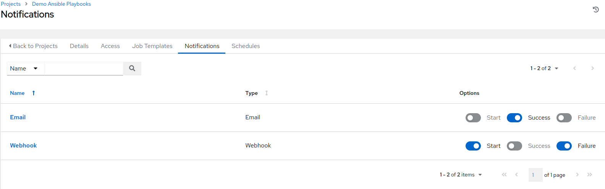

# AWX Monitoring and Status Views


## AWX Status Views


### Dashboard


### Jobs


### Schedules


### Activity Streams


### The Workflow Approval View


## Management Jobs


## Notifications


```
{{ job_friendly_name }} #{{ job.id }} '{{ job.name }}' {{ job.status }}: {{ url }}
```


```
{{ job_friendly_name }} #{{ job.id }} '{{ job.name }}' {{ job.status }}: {{ url }}
```


```
{{ job_friendly_name }} #{{ job.id }} had status {{ job.status }}, view details at {{ url }}

{{ job_metadata }}
```




## Logging


```bash
kubectl -n awx logs <pod-name> -f
```


```bash
kubectl -n awx logs -l app.kubernetes.io/part-of=awx -f
```


```bash
kubectl -n awx describe pod automation-job-<id>
```


```bash
tail -f /var/log/receptor/receptor.log
```


```bash
---
[...]
[...]
- log-level: info
[...]
[...]
 
```


## Metrics


```bash
curl -k -u admin:Ansible123! https://awx.example.com/api/v2/metrics/
```