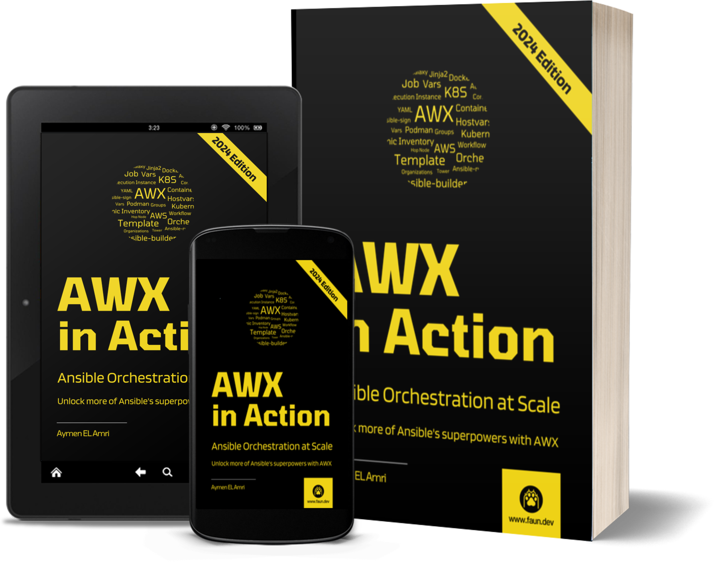

# AWX in Action: Ansible Orchestration at Scale

This repository contains the code snippets used in [AWX in Action: Ansible Orchestration at Scale](#todo).

## Who This Book Is For

This guide is tailored for individuals who are already familiar with Ansible and are looking to expand their automation capabilities. If you’re an IT professional, DevOps specialist, or system administrator who has relied on Ansible to streamline workflows, deploy applications, and manage configurations, this guide will take your skills to the next level with AWX.

**Experienced Ansible Users**: If you’ve been using Ansible from the command line and are comfortable writing playbooks and roles, this guide will introduce you to the benefits of AWX. You’ll learn how to leverage its web-based interface to manage and scale your automation efforts more effectively.

**DevOps Specialists**: For those integrating automation into continuous integration and continuous deployment (CI/CD) pipelines, this guide will show you how AWX can seamlessly fit into your existing processes. You’ll gain insights on how to orchestrate complex workflows and ensure consistent deployments across various environments.

**System Administrators**: If you manage a variety of servers and services, this guide will demonstrate how AWX can simplify your tasks. You’ll discover how to use AWX to schedule jobs, manage inventory, handle job templates and alerts, and monitor your infrastructure.

**Cloud-Native Practitioners**: Those working in cloud-native environments will find this guide particularly useful. You'll see how AWX can be integrated with cloud services and container orchestration platforms to automate infrastructure management and application deployment.

**Security Engineers**: If your focus is on improving security, this guide will highlight how AWX can help enforce security policies, manage access controls, securely manage credentials, and audit automation tasks to ensure compliance with organizational standards.

**SRE Professionals**: Site Reliability Engineers (SREs) looking to implement reliable, repeatable, and scalable automation processes will benefit from the detailed workflows and strategies presented in this guide. AWX's capabilities in monitoring, managing automated tasks, signing off on changes, and managing alerts align well with SRE principles.

**Developers**: For developers looking to automate deployment tasks, testing, on-demand environments, and other repetitive tasks, this guide will show you how to use AWX to streamline your workflows. For developers working in a DevOps environment, this guide will help you understand how to integrate your development workflows with CI tools and automation processes.

**Teams and Organizations**: Whether you're part of a small team or a large organization, this guide will show you how to collaborate effectively using AWX. You'll learn how to share automation tasks, manage user permissions, and ensure consistent execution across your infrastructure.

**Red Hat Ansible Automation Platform Users**: AWX is the upstream project for the Red Hat Ansible Automation Platform. If you're using the commercial version of Ansible, this guide will help you understand the underlying technology and many of the features available in the commercial offering.

In essence, if you are aiming to move beyond a simple Ansible setup and want to explore a sophisticated Ansible-based automation platform, this guide is for you.

## What You Will Learn

In this guide, you will embark on a comprehensive journey through AWX, the powerful web-based interface for Ansible. By the end of this guide, you will have gained a thorough understanding of how to leverage AWX to enhance and scale your automation workflows. Here's a preview of what you'll learn:

**Installation and Configuration**

You'll start with the essentials of setting up AWX in your environment. We will explore various installation methods, including using Docker and deploying AWX to a Kubernetes cluster. Documentation regarding installation can be overwhelming, but we will simplify the process and guide you through the steps to get AWX up and running.

**AWX Organizations, Users, and Teams**

Understand how to organize your automation environment by setting up organizations, users, and teams in AWX. Learn how these elements fit together and how they can be used to manage permissions and streamline your automation processes.

**Hosts and Inventories**

Dive into managing hosts and inventories within AWX. You will learn how to create and manage static and dynamic inventories (e.g., AWS), group hosts, add credentials, and use constructed inventories for more advanced scenarios.

**Projects, Templates, and Jobs**

Master the core components of AWX by exploring projects, job templates, and jobs. You'll learn how to create and manage projects, configure job templates, run ad hoc commands, and launch and schedule jobs. Additionally, you'll understand the lifecycle of an AWX job and how to automate complex workflows using workflow templates and surveys. You'll also learn about enabling content signature validation to ensure the integrity of your automation content. You will understand project synchronization, job notifications, and how to manage job artifacts. This part is crucial for understanding how to automate your automation, and that's why this guide focuses on it by providing practical examples and best practices.

**AWX CLI**

Discover the power of the AWX Command Line Interface (CLI). Learn what the AWX CLI is, why it is beneficial, and how to install and authenticate it. You'll also explore generating organization-scoped tokens, managing resources, and importing and exporting data.

**Execution Environments and Instances**

Gain insights into execution environments and instances. Learn about creating custom execution environments using Ansible Builder and Ansible Runner, adding and building execution environments, and managing execution and hop instances. You will also delve into instance groups, clustering, container groups, and capacity adjustment to optimize your automation infrastructure. This guide covers this part as it is crucial for scaling your automation and ensuring high availability. It not only provides practical examples but also shares how AWX internally works to help you understand the concepts better.

**AWX Settings**

Explore the various settings in AWX, including authentication, job settings, and logging. Understand how and where to configure settings, manage cache, debug, and logging settings, and other advanced settings to optimize your AWX environment.

**AWX Monitoring and Status Views**

Understand how to monitor your AWX setup and view status updates. You will learn about different status views like the dashboard, jobs, schedules, and activity streams. Additionally, you will explore management jobs, notifications, logging, and metrics to keep track of your automation processes. If you plan to monitor your automation using Prometheus and Grafana, this guide gives you a head start.

**Real World Example**

Finally, put your knowledge into practice with a real-world example. Learn how to use custom execution environments and external roles, create workflows, schedule and send notifications, launch jobs using the AWX CLI, AWX API, and from your CI pipelines. This part goes back to the most important part of this guide, which is to provide you with a practical example that you can use as a starting reference for your future automation tasks.

By the end of this guide, you will be equipped with the necessary knowledge and skills to succeed in your AWX adoption journey as an individual or as part of a team.

## Join the Community

This guide was published by FAUN, a community of developers, architects, and software engineers who are passionate about learning and sharing their knowledge. If you're interested in joining the community, you can start by subscribing to our newsletter at [faun.dev/join](https://faun.dev/join). Every week, we share the most important and relevant articles, tutorials, and videos on the latest technologies and trends, including cloud-native, DevOps, automation, and more.

You can also follow us on Twitter at [@joinFAUN](https://twitter.com/joinFAUN) and [LinkedIn](https://www.linkedin.com/company/22322295) to stay up-to-date with the latest news and announcements.

## About the Author

Aymen El Amri is a software engineer, trainer, author, and entrepreneur. He is the founder of the FAUN Developer Community. He is the author of multiple books on software engineering. You can find him on [Twitter](https://twitter.com/eon01) and [LinkedIn](https://www.linkedin.com/in/elamriaymen/).

